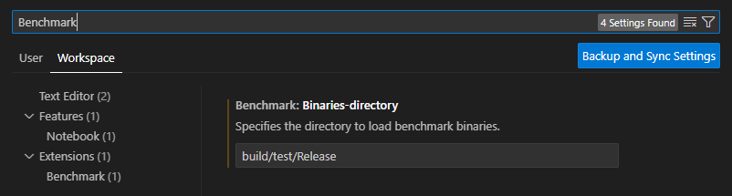
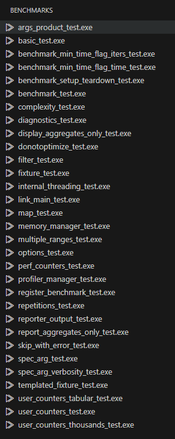
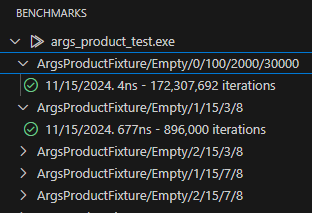

# benchmark-vscode README

A vscode extension for running and exploring benchmarks written with Google's benchmark library

Building examples included with this project
---

This project includes a set of simple benchmarks to use with the extension.  To build them:

    cd sample_benchmarks
    cmake -S . -B build
    cmake --build build --config Release

N.B this assumes that benchmark is built and available.

Using the extension
---

Once installed, you will notice the small timer appear on the left activity bar.  Clicking on this will then use the configured benchmark directory to find your benchmark executables.  If this value has not been configured, it will default to all exes under 'build/Release' from the project workspace.

If your executables reside somewhere else, this can be updated to reflect that:

In either case, once the executables are found, you will see a list of them appear in the benchmark view:

Right clicking on any given benchmark binary will offer the chance to run and discover the benchmarks contained in each binary.

After the benchmark has finished executing, the included benchmark names will be displayed and can be expanded to see the time and iteration count of each:

Each individual benchmark can then be run by right clicking and selecting "Run this benchmark"

Feedback
---

Please raise an issue for any kind of feedback you may have.  This would be very welcomed to help drive the direction of this extension.